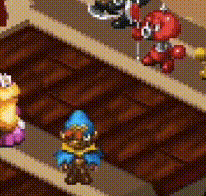
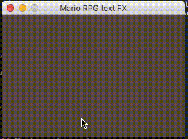

## Mario RPG style text animations

Render text in the style of Mario RPG's stat buff notifications, e.g., `ATTACK UP!`

Made with Pygame.

 

### Requires

- Python 3.8+
- Pygame 2.X

### Tested on

- MacOS 10.13
- Ubuntu 18.04
- Windows 10

## Try it out

> python main.py "your phrase here!"

### Notes

- I drew the letters in `pixel_alphabet.png` with Aseprite, and only alpha characters, period, single quote / apostraphe, space, and exclamation point are currently supported.
- The max line length is set to 8 characters; I think it's more like 6 in the actual game, but 8 allows you to say more -- beyond that though, to me, it stops feeling authentic.
- The max number of lines is currently set to 3. Again, I think you only see a max of 2 in-game.
